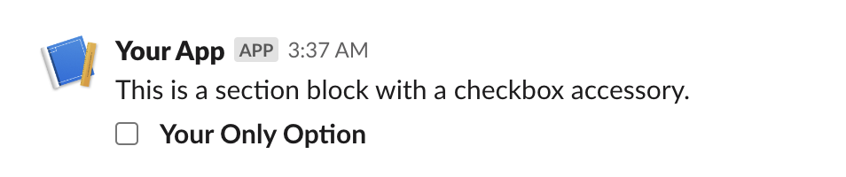
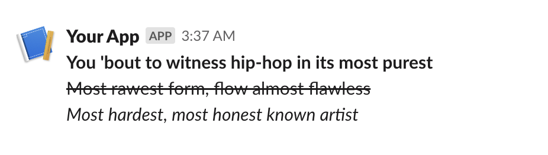
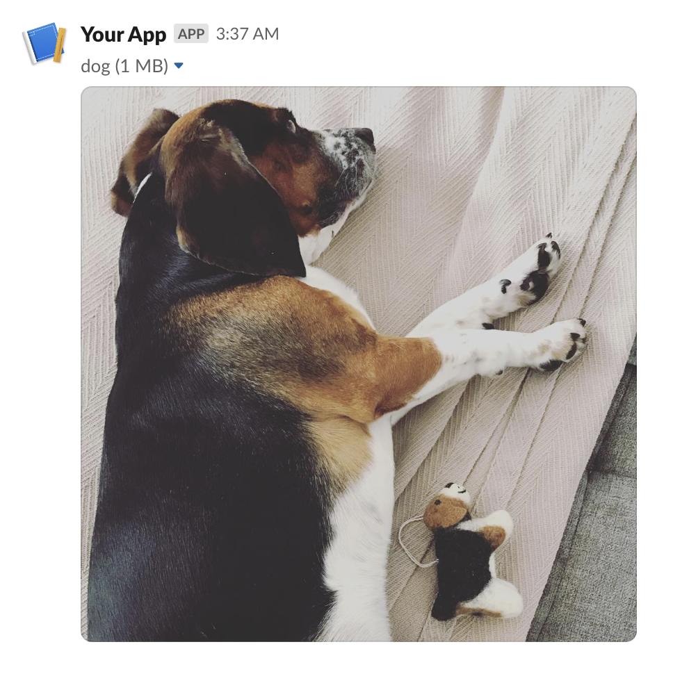
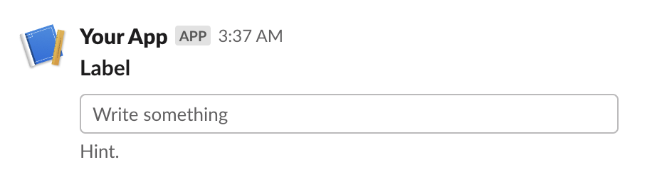
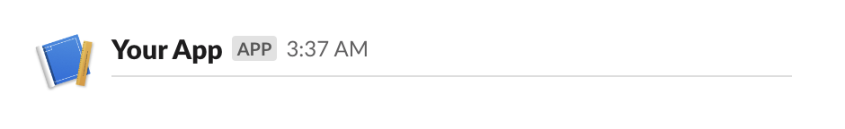
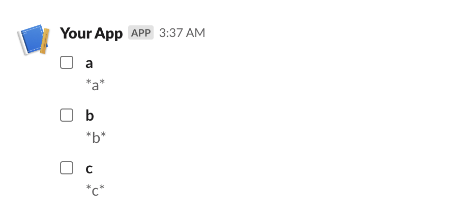

## Section Block
:::blocks.SectionBlock
    options:
        show_bases: false
        show_source: false


=== "`slackblocks`"
    
    ```python
    from slackblocks import Checkboxes, Option, SectionBlock

    SectionBlock(
        text="This is a section block with a checkbox accessory.", 
        block_id="fake_block_id"
        accessory=CheckboxGroup(
            action_id="checkboxes-action",
            options=[
                Option(
                    text="*Your Only Option*",
                    value="option_one"
                )
            ]
        )
    )
    ```

=== "JSON"
    ```json
    {
        "type": "section",
        "block_id": "fake_block_id",
        "text": {
            "type": "mrkdwn",
            "text": "This is a section block with a checkbox accessory."
        },
        "accessory": {
            "type": "checkboxes",
            "options": [
                {
                    "text": {
                        "type": "mrkdwn",
                        "text": "*Your Only Option*"
                    },
                    "value": "option_one"
                }
            ],
            "action_id": "checkboxes-action"
        }
    }
    ```

=== "Slack UI"
    


## Rich Text Block
:::blocks.RichTextBlock
    options:
        show_bases: false
        show_source: false

=== "`slackblocks`"
    ```python
    from slackblock import RichTextBlock, RichTextSection, RichText

    RichTextBlock(
        RichTextSection(
            [
                RichText(
                    "You 'bout to witness hip-hop in its most purest",
                    bold=True,
                ),
                RichText(
                    "Most rawest form, flow almost flawless",
                    strike=True,
                ),
                RichText(
                    "Most hardest, most honest known artist",
                    italic=True,
                ),
            ]
        ),
        block_id="fake_block_id",
    )
    ```

=== "JSON"
    ```json
    {
        "type": "rich_text",
        "block_id": "fake_block_id",
        "elements": [
            {
                "type": "rich_text_section",
                "elements": [
                    {
                        "type": "text",
                        "text": "You 'bout to witness hip-hop in its most purest\n",
                        "style": {
                            "bold": true
                        }
                    },
                    {
                        "type": "text",
                        "text": "Most rawest form, flow almost flawless\n",
                        "style": {
                            "strike": true
                        }
                    },
                    {
                        "type": "text",
                        "text": "Most hardest, most honest known artist\n",
                        "style": {
                            "italic": true
                        }
                    }
                ]
            }
        ]
    }
    ```

=== "Slack UI"
    


## Header Block
:::blocks.HeaderBlock
    options:
        show_bases: false
        show_source: false


=== "`slackblocks`"
    ```python
    from slackblocks import HeaderBlock

    HeaderBlock(
        "This is a header block",
    )
    ```

=== "JSON"
    ```json
    {
        "type": "header",
        "text": {
            "type": "plain_text",
            "text": "This is a header block",
            "emoji": true
        }
    }
    ```

=== "Slack UI"
    


## Image Block
:::blocks.ImageBlock
    options:
        show_bases: false
        show_source: false


=== "`slackblocks`"
    ```python
    from slackblocks import ImageBlock

    ImageBlock(
        image_url="https://api.slack.com/img/blocks/bkb_template_images/beagle.png",
        alt_text="a beagle",
        title="dog",
        block_id="fake_block_id",
    )
    ```

=== "JSON"
    ```json
    {
        "type": "image",
        "block_id": "fake_block_id",
        "image_url": "https://api.slack.com/img/blocks/bkb_template_images/beagle.png",
        "alt_text": "a beagle",
        "title": {
            "type": "plain_text",
            "text": "dog"
        }
    }
    ```

=== "Slack UI"
    


## Input Block
:::blocks.InputBlock
    options:
        show_bases: false
        show_source: false


=== "`slackblocks`"
    ```python
    from slackblocks import InputBlock, Text, TextType, PlainTextInput

    InputBlock(
        label=Text("Label", type_=TextType.PLAINTEXT, emoji=True),
        hint=Text("Hint", type_=TextType.PLAINTEXT, emoji=True),
        element=PlainTextInput(action_id="action"),
        block_id="fake_block_id",
        optional=True,
    )
    ```

=== "JSON"
    ```json
    {
        "type": "input",
        "block_id": "fake_block_id",
        "label": {
            "type": "plain_text",
            "text": "Label",
            "emoji": true
        },
        "element": {
            "type": "plain_text_input",
            "action_id": "action"
        },
        "hint": {
            "type": "plain_text",
            "text": "Hint",
            "emoji": true
        },
        "optional": true
    }
    ```

=== "Slack UI"
    


## Divider Block
:::blocks.DividerBlock
    options:
        show_bases: false
        show_source: false


=== "`slackblocks`"
    ```python
    from slackblocks import DividerBlock

    DividerBlock()
    ```

=== "JSON"
    ```json
    {
        "type": "divider"
    }
    ```

=== "Slack UI"
    


## File Block
:::blocks.FileBlock
    options:
        show_bases: false
        show_source: false


=== "`slackblocks`"
    ```python
    from slackblocks import FileBlock

    FileBlock(
        external_id="external_id",
        block_id="fake_block_id",
    )
    ```

=== "JSON"
    ```json
    {
        "type": "file",
        "external_id": "external_id",
        "source": "remote",
        "block_id": "fake_block_id"
    }
    ```

=== "Slack UI"
    
    * Note that this example comes from the Slack Web API docs.


## Context Block
:::blocks.ContextBlock
    options:
        show_bases: false
        show_source: false


=== "`slackblocks`"
    ```python
    from slackblocks import ContextBlock, Text

    ContextBlock(
        elements=[
            Text("Hello, world!"),
        ], 
        block_id="fake_block_id"
    )
    ```

=== "JSON"
    ```json
    {
        "type": "context",
        "block_id": "fake_block_id",
        "elements": [
            {
                "type": "mrkdwn",
                "text": "Hello, world!"
            }
        ]
    }
    ```

=== "Slack UI"
    

## Actions Block
:::blocks.ActionsBlock
    options:
        show_bases: false
        show_source: false

=== "`slackblocks`"
    ```python
    ActionsBlock(
        block_id="fake_block_id",
        elements=CheckboxGroup(
            action_id="actionId-0",
            options=[
                Option(text="*a*", value="a", description="*a*"),
                Option(text="*b*", value="b", description="*b*"),
                Option(text="*c*", value="c", description="*c*"),
            ],
        ),
    )
    ```

=== "JSON"
    ```json
    {
        "type": "actions",
        "block_id": "fake_block_id",
        "elements": [
            {
                "type": "checkboxes",
                "action_id": "actionId-0",
                "options": [
                    {
                        "text": {
                            "type": "mrkdwn",
                            "text": "*a*"
                        },
                        "value": "a",
                        "description": {
                            "type": "plain_text",
                            "text": "*a*"
                        }
                    },
                    {
                        "text": {
                            "type": "mrkdwn",
                            "text": "*b*"
                        },
                        "value": "b",
                        "description": {
                            "type": "plain_text",
                            "text": "*b*"
                        }
                    },
                    {
                        "text": {
                            "type": "mrkdwn",
                            "text": "*c*"
                        },
                        "value": "c",
                        "description": {
                            "type": "plain_text",
                            "text": "*c*"
                        }
                    }
                ]
            }
        ]
    }
    ```

=== "Slack UI"
    
