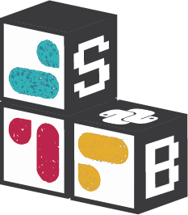

# Welcome to `slackblocks`!

  

`slackblocks` is Python package for creating complex Slack messages 
    using the Slack [BlockKit API](https://api.slack.com/block-kit).

It exists so you don't have to define block-based Slack messages by
    hand-writing JSON.

## Components

The [Slack BlockKit API](https://api.slack.com/block-kit) defines a number of 
    different resource types (all defined in JSON) which work together to 
    define Block-based messages.

`slackblocks` makes using this API easier by providing a hierarchy of Python
    classes that represent these resources.

### Objects
[`Objects`](/slackblocks/latest/reference/messages/objects) (e.g. [`Text`](/slackblocks/latest/reference/messages/objects/#objects.Text)) 
    are the lowest level pimitives that are used to populate 
    [`Elements`](/slackblocks/latest/reference/messages/elements) and [`Blocks`](/slackblocks/latest/reference/messages/blocks).

### Elements
[`Elements`](/slackblocks/latest/reference/messages/elements) are typically interactive UI elements that take
    in [`Object`](/slackblocks/latest/reference/messages/objects) to define their content. For example, the 
    [`CheckboxGroup`](/elements/#elements.CheckboxGroup) element takes in one or
    more [`Option`](/slackblocks/latest/reference/messages/objects/#objects.Option) items and presents a
    checkbox menu to the user with those options.

### Blocks
[`Blocks`](/slackblocks/latest/reference/messages/blocks) are the core element of the API, with different 
    [`Blocks`](/slackblocks/latest/reference/messages/blocks) used to create different types of visual
    elements. For example, the [`DividerBlock`](/slackblocks/latest/reference/messages/blocks/#blocks.DividerBlock), 
    when rendered, will show a visual element similar to a `
` HTML element. The
    [`RichTextBlock`](/slackblocks/latest/reference/messages/blocks/#blocks.RichTextBlock) on the other hand
    allows for the display of text elements with visual styling like italics,
    block quotes, lists and code blocks. 

### Messages
[`Messages`](/slackblocks/latest/reference/messages/messages/) are a convenience wrapper around `Blocks` that
    can be unpacked as arguments straight into the official Slack Python SDK (or
    its legacy `slackclient` counterpart).

### Views
[`Views`](reference/views/) are an alternative usage for [`Blocks`](/slackblocks/latest/reference/messages/blocks)
    that allow for the creation of custom UI "surfaces" within Slack, e.g. for 
    third-party apps.

## Guides
In addition to a complete reference of all classes and functions provided by the 
    `slackblocks` library, this documentation contains guides on:

- [Installing `slackblocks`](usage/installation/)
- [Using Blocks](usage/using_blocks/)
- [Sending Block-based Messages](usage/sending_messages/)