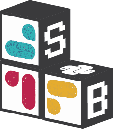

# Welcome to `slackblocks`!

<p align="center">
  
</p>

`slackblocks` is a Python library for building Slack messages with the [Block Kit API](https://api.slack.com/block-kit) — without writing JSON by hand.

It exists because Block Kit JSON is verbose, easy to get subtly wrong, and unpleasant to maintain in source control. `slackblocks` gives you:

- **Typed Python classes** for every block, element, and object Slack supports.
- **Validation as you build** — character limits, required fields, mutually-exclusive options, and element-type restrictions are enforced at construction time, so you find out *before* hitting Slack's API.
- **Drop-in compatibility** with both the official [`slack-sdk`](https://pypi.org/project/slack-sdk/) and the legacy [`slackclient`](https://pypi.org/project/slackclient/) — unpack a `Message` directly into `client.chat_postMessage(**message)`.
- **Zero runtime dependencies.**

## Quickstart

```bash
pip install slackblocks
```

```python
from slackblocks import HeaderBlock, Message, SectionBlock, DividerBlock

message = Message(
    channel="#general",
    blocks=[
        HeaderBlock("Build #482 passed :white_check_mark:"),
        SectionBlock("All 1,247 tests green in 3m 12s."),
        DividerBlock(),
        SectionBlock("*Author:* @nick  •  *Branch:* `main`"),
    ],
)

print(message.json())
```

See the [installation guide](usage/installation.md) and [sending messages guide](usage/sending_messages.md) to take it from here.

## Components

The [Slack Block Kit API](https://api.slack.com/block-kit) defines several resource types (all defined in JSON) that work together to build block-based messages. `slackblocks` mirrors that hierarchy with Python classes.

### Objects

[Objects](reference/objects.md) (e.g. [`Text`](reference/objects.md#objects.Text), [`Option`](reference/objects.md#objects.Option), [`Confirm`](reference/objects.md#objects.Confirm)) are the lowest-level primitives — small composable pieces that populate [Elements](reference/elements.md) and [Blocks](reference/blocks.md).

### Elements

[Elements](reference/elements.md) are typically interactive UI controls that go *inside* blocks. The [`CheckboxGroup`](reference/elements.md#elements.CheckboxGroup) element, for instance, takes one or more [`Option`](reference/objects.md#objects.Option) items and presents a checkbox menu.

### Blocks

[Blocks](reference/blocks.md) are the core visual unit of a message. Different block classes produce different UI:

- [`SectionBlock`](reference/blocks.md#blocks.SectionBlock) — a chunk of markdown text, optionally with an accessory element.
- [`HeaderBlock`](reference/blocks.md#blocks.HeaderBlock) — a large bold title.
- [`DividerBlock`](reference/blocks.md#blocks.DividerBlock) — a visual separator (like an HTML `<hr>`).
- [`RichTextBlock`](reference/blocks.md#blocks.RichTextBlock) — formatted text with inline styling, lists, code blocks, and quotes.
- [`ActionsBlock`](reference/blocks.md#blocks.ActionsBlock) — a row of interactive elements like buttons or menus.
- [`ImageBlock`](reference/blocks.md#blocks.ImageBlock), [`ContextBlock`](reference/blocks.md#blocks.ContextBlock), [`InputBlock`](reference/blocks.md#blocks.InputBlock), [`FileBlock`](reference/blocks.md#blocks.FileBlock), [`TableBlock`](reference/blocks.md#blocks.TableBlock).

See [Using Blocks](usage/using_blocks.md) for examples of all block types side-by-side with their JSON output and Slack rendering.

### Messages

[Messages](reference/messages.md) are a convenience wrapper around blocks that can be unpacked directly into the Slack SDK's `chat_postMessage` (and friends).

- [`Message`](reference/messages.md#messages.Message) — a normal channel message.
- [`WebhookMessage`](reference/messages.md#messages.WebhookMessage) — for incoming webhooks.
- [`MessageResponse`](reference/messages.md#messages.MessageResponse) — replies to slash commands and interactions.

### Views

[Views](reference/views.md) are an alternative usage of blocks that build custom UI surfaces in Slack — modal dialogs and the App Home tab — typically used by interactive Slack apps.

## Guides

- [Installation](usage/installation.md)
- [Using Blocks](usage/using_blocks.md)
- [Sending Messages](usage/sending_messages.md)
- [Cookbook](usage/cookbook.md) — complete end-to-end recipes for common message patterns.
- [Troubleshooting & FAQ](usage/troubleshooting.md)
- [Contributing](contributing.md) — developing and contributing to `slackblocks` itself.
